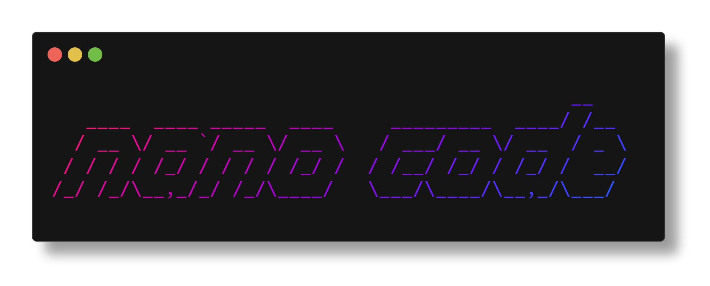

<div align="center">
  <picture>
    
  </picture>
  <h1>nano-code</h1>
	<p>
    <strong>
      A tiny agent in your terminal
    </strong>
  </p>
  <p>
    <code>uvx nano-code@latest</code>
  </p>
  <p>
    <a href="https://pypi.org/project/nano-code/">
      
    </a>
  </p>
</div>


`nano-code` is a **tiny, batteries-included code-assistant** written in Python.  Inspired by Google’s *Gemini Code*, it lets you spin up an interactive CLI agent powered by OpenAI (or any compatible) LLM and a growing toolbox of actions such as reading files, listing directories, searching text and more.

The project aims to be **small enough to grok in one sitting** yet **powerful enough to be genuinely useful** when navigating or refactoring real-world codebases.


## ✨ Features

| Feature | Description |
|---------|-------------|
| ⚡ **Instant CLI** | Run `nano-code` and start chatting immediately |
| 🛠 **Rich Toolset** | Built-in tools for filesystem operations and more |
| 🧠 **Smart Memory** | Persistent session context with cost tracking |
| 🔌 **Pluggable LLMs** | OpenAI-compatible with easy provider switching |
| 📦 **Zero Config** | Works out of the box with sensible defaults |


### Built-in Tools
- **File Operations**: `list_dir`, `find_files`, `read_file`, `create_file`, `edit_file`, `mv_file_or_dir`
- **Search & Analysis**: `search_text` with regex support
- **Task Management**: `add_tasks` for quick TODO capture
- **Easy Extensibility**: Simple plugin system for custom tools

## 🚀 Installation

### Quick Start (Recommended)
```bash
# Install and run with uv (fastest)
uvx nano-code@latest
```

### Development Setup
```bash
# Clone the repo
git clone https://github.com/gusye1234/nano-code.git
cd nano-code

# Install with uv (recommended)
uv sync

# Or install in development mode
uv pip install -e '.[dev]'

# Or use pip
pip install -e '.[dev]'
```

### Requirements
- Python ≥ 3.11
- OpenAI-compatible API key

### Environment Setup
```bash
# Required: Set your OpenAI API key
export OPENAI_API_KEY="sk-..."

# Optional: Custom endpoint (for OpenAI-compatible APIs)
export LLM_BASE_URL="https://api.openai.com/v1"

# Optional: Default model override
export LLM_MAIN_MODEL="gpt-4.1"
```

## ⚙️ Configuration

Configure nano-code using either environment variables or a config file. Environment variables take precedence over config files.

### Method 1: Environment Variables (Recommended)
```bash
export OPENAI_API_KEY="sk-..."           # Required
export LLM_BASE_URL="https://api.openai.com/v1"  # Optional
export LLM_MAIN_MODEL="gpt-4.1"         # Optional
```

### Method 2: Config File
Create `~/.nano_code/config.json`:

```json
{
  "llm_api_key": "sk-...",
  "llm_base_url": "https://api.openai.com/v1",
  "llm_main_model": "gpt-4.1"
}
```

**Config file locations:**
- **Linux/macOS**: `~/.nano_code/config.json`
- **Windows**: `%USERPROFILE%\.nano_code\config.json`

See `nano_code/env.py` for all supported configuration options.

## 🏃‍♀️ Quickstart

### One-liner (Recommended)
```bash
uvx nano-code
```

### From source
```bash
# After installing from source
python -m nano_code
# OR
nano-code
```

### First Run
1. Run `nano-code` in your project directory
2. The agent will start with your current directory as the working context
3. Start chatting! Try:
   - "List all Python files in this project"
   - "Find TODO comments in the codebase"
   - "Read the main README file"

## 🗂 Project Structure

```
nano-code/
├── nano_code/                  # Core library and agent code
│   ├── __init__.py             # Package marker, version
│   ├── __main__.py             # Main entrypoint, interactive console agent
│   ├── constants.py            # Global constants (paths, file limits, names)
│   ├── env.py                  # Loads/holds environment configs (API keys, models)
│   ├── utils/                  # General utility functions
│   │   ├── file.py             # Helpers for file type checks/extensions/MIME
│   │   ├── logger.py           # Logging utility (session and console)
│   │   ├── paths.py            # Finds the git repository root upwards from a dir
│   │   └── tokens.py           # Token counting/truncation utilities (tiktoken)
│   ├── core/                   # Session, checkpoints, and memory management
│   │   ├── cost.py             # Records/checkpoints LLM/tool usage/errors
│   │   └── session.py          # Session context: cwd, logging, ignores, memory, etc.
│   ├── llm/                    # Language model and API interaction
│   │   ├── __init__.py         # Unified LLM API interface and orchestration
│   │   ├── openai_model.py     # Direct async OpenAI chat completion implementation
│   │   └── clients.py          # OpenAI async client factory/caching
│   ├── agent_tool/             # Pluggable agent tools for OS & utility ops
│   │   ├── __init__.py         # Package marker
│   │   ├── base.py             # Abstract classes/base models for agent tools
│   │   ├── registry.py         # Tool registry for lookup and execution
│   │   ├── tool_schema.py      # Custom schema validator for tool argument checks
│   │   ├── tools.py            # Registers/organizes sets of OS/util tools
│   │   ├── os_tool/            # Tools for filesystem/search actions
│   │   │   ├── __init__.py
│   │   │   ├── create_file.py  # Tool: Write a new file with content
│   │   │   ├── edit_file.py    # Tool: Edit file's lines (replace/insert/delete)
│   │   │   ├── find_files.py   # Tool: Find files by glob, respect ignore, sort by mtime
│   │   │   ├── list_dir.py     # Tool: List a directory's contents
│   │   │   ├── mv_file_or_dir.py  # Tool: Move or rename files or directories
│   │   │   ├── read_file.py    # Tool: Read text file content (by lines), safe + annotated
│   │   │   └── search_text.py  # Tool: Search regex in files, return line context
│   │   └── util_tool/          # Utility tools
│   │       └── add_tasks.py    # Tool: Parse markdown checkboxes to a global todo-list
│   └── agent/                  # (Placeholder for non-interactive agent logic)
│       └── non_interactive_agent.py   # Reserved for future non-interactive agent implementation
│
├── tests/                      # Pytest test suite for agent tools/helpers
├── assets/                     # Project assets (logo, etc.)
├── .github/                    # GitHub configuration files
├── pyproject.toml             # Project configuration and dependencies
└── README.md                  # This file - Project documentation
```

### Key Components
- **Session System**: Maintains context across interactions
- **Tool Registry**: Pluggable architecture for custom tools
- **LLM Abstraction**: Provider-agnostic LLM interface
- **Cost Tracking**: Real-time usage and cost monitoring

## 🤝 Contributing

We welcome contributions! The codebase is intentionally small and designed for easy extension.

### Getting Started
```bash
# Clone and setup
git clone https://github.com/gusye1234/nano-code.git
cd nano-code
uv sync

# Run tests
pytest -q

# Run tests with coverage
pytest --cov=nano_code tests/
```

### Contribution Guidelines
- **Add new tools**: Easy plugin system for custom functionality
- **Improve documentation**: Help make the project more accessible
- **Extend test coverage**: Ensure reliability for all features
- **Report bugs**: Create issues for any problems you encounter

For significant changes, please open an issue first to discuss your approach.

## 📜 License

This project is licensed under the MIT License - see the [LICENSE](LICENSE) file for details.

## 🏷️ Disclaimer

Any git commit that starts with `nc:` is written by nano-code itself.

---

<div align="center">
  <p>
    Built with ❤️ by the nano-code community
  </p>
  <p>
    <a href="https://github.com/gusye1234/nano-code">⭐ Star this project on GitHub</a>
  </p>
</div>