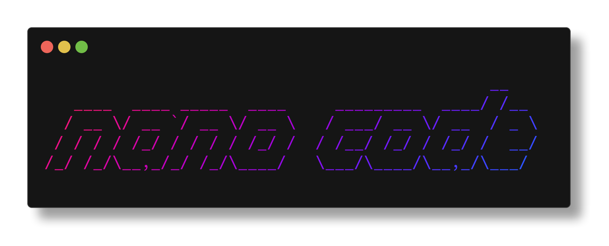

<div align="center">
  <picture>
    
  </picture>
  <h1>nano-code 沙盒文件分析系统</h1>
	<p>
    <strong>
      自动化沙盒文件分析助手 - 双沙盒架构
    </strong>
  </p>
  <p>
    <code>python3 docker_1.py</code> 或 <code>python3 daytona_proxy.py</code>
  </p>
</div>

# 🚀 nano-code Python文件分析系统

`nano-code` 是一个**专注于Python开发的沙盒文件分析系统**，专为安全的Python代码分析和数据处理而设计。现已支持**双沙盒架构**：**本地Docker沙盒**和**云端Daytona沙盒**，让您能够根据需求选择最适合的执行环境。

## 🏗️ 双沙盒架构

### 🐳 方案一：本地Docker沙盒
**完全本地化的沙盒环境**
- **执行环境**: 本地Docker容器
- **数据隔离**: 完全本地，无需网络传输
- **性能**: 低延迟，快速响应
- **适用场景**: 数据敏感、网络受限环境

### ☁️ 方案二：云端Daytona沙盒  
**基于云端的弹性沙盒环境**
- **执行环境**: Daytona云端容器
- **扩展性**: 自动扩容，无需本地资源
- **维护**: 无需管理Docker环境
- **适用场景**: 资源受限设备、团队协作

## ✨ 核心特性

| 特性 | 本地Docker | 云端Daytona |
|---------|-------------|-------------|
| 🔒 **完全沙盒隔离** | ✅ 本地容器隔离 | ✅ 云端容器隔离 |
| 📤 **自动文件上传** | ✅ 本地目录映射 | ✅ 云端文件传输 |
| 📥 **智能结果下载** | ✅ 自动收集结果 | ✅ 云端结果下载 |
| 🤖 **AI智能分析** | ✅ 本地LLM调用 | ✅ 本地LLM调用 |
| 🛠 **Python工具集** | ✅ 完整工具支持 | ✅ 完整工具支持 |
| ⚡ **启动速度** | 中等（需构建镜像） | 极快（<200ms） |
| 💾 **资源消耗** | 本地CPU/内存 | 云端资源 |

### 支持的文件类型
- **Python源码**: .py文件的语法检查、结构分析
- **数据文件**: CSV、JSON等数据文件的统计分析
- **配置文件**: YAML、TOML、INI等Python项目配置文件
- **文档和日志**: TXT、Markdown、日志文件的文本分析

## 🛠 系统要求

### 🐳 本地Docker沙盒环境
- **操作系统**: macOS / Linux
- **Docker**: 正在运行的Docker服务 
- **Python**: 3.11+
- **磁盘空间**: 至少2GB可用空间

### ☁️ 云端Daytona沙盒环境
- **操作系统**: macOS / Linux / Windows
- **Python**: 3.11+
- **网络**: 稳定的互联网连接
- **Daytona账户**: 有效的API密钥

### 环境验证
```bash
# 检查Python版本
python3 --version

# 本地Docker环境验证
docker --version
docker ps

# 云端Daytona环境验证
# 无需本地Docker，只需API密钥
```

## 🚀 安装和设置

### 1. 克隆项目
```bash
git clone https://github.com/gusye1234/nano-code.git
cd nano-code
```

### 2. 配置API密钥
创建配置文件 `~/.nano_code/config.json`:
```json
{
  "llm_api_key": "sk-your-openai-api-key",
  "llm_base_url": "https://api.openai.com/v1",
  "llm_main_model": "gpt-4"
}
```

### 3. 选择沙盒环境

#### 🐳 本地Docker沙盒设置
```bash
# 构建沙盒镜像
docker build -f Dockerfile.sandbox -t nano-code-sandbox .

# 验证镜像构建
docker images | grep nano-code-sandbox
```

#### ☁️ 云端Daytona沙盒设置
```bash
# 安装Daytona SDK（如果需要）
pip install daytona

# 修改daytona_proxy.py中的API密钥
# 或通过环境变量设置
export DAYTONA_API_KEY="your-daytona-api-key"
```

## 🏃‍♀️ 使用方法

### 📋 选择运行模式

#### 🐳 方式一：本地Docker沙盒
```bash
python3 docker_1.py
```

#### ☁️ 方式二：云端Daytona沙盒
```bash
python3 daytona_proxy.py
```

### 🔄 标准工作流程

#### 1. 准备分析文件
```bash
# 创建工作目录（系统会自动创建）
mkdir -p ~/Desktop/SandboxWork/upload
mkdir -p ~/Desktop/SandboxWork/download

# 将要分析的文件放入上传目录
cp your_data.csv ~/Desktop/SandboxWork/upload/
cp your_script.py ~/Desktop/SandboxWork/upload/
```

#### 2. 启动分析系统
**本地Docker模式**:
```bash
cd /path/to/nano-code
python3 docker_1.py
```

**云端Daytona模式**:
```bash  
cd /path/to/nano-code
python3 daytona_proxy.py
```

#### 3. 与AI助手交互
系统启动后，你可以与AI助手对话分析文件：

**Docker模式路径**:
```
User: 请分析 /workspace/input/data.csv 文件，生成基础统计信息
Assistant: 我将帮你分析CSV文件...
```

**Daytona模式路径**:
```
User: 请分析 /workspace/data.csv 文件，生成统计报告
Assistant: 我将帮你分析CSV文件...
```

#### 4. 查看分析结果
分析完成后：
- **Docker模式**: 结果自动下载到 `~/Desktop/SandboxWork/download/`
- **Daytona模式**: 结果保存在云端沙盒中，可通过nano-code工具下载

## 🏗️ Agent系统架构

nano-code采用模块化的Agent系统架构，支持**双沙盒执行环境**，提供安全、可控的代码执行和文件操作环境。

### 🔄 双沙盒执行架构

#### 本地执行模式 (docker_1.py)
```
用户 → AutoSandboxManager → Docker容器 → nano-code Agent → 工具执行
     ↑                     ↓
   文件上传              结果下载
```

#### 云端执行模式 (daytona_proxy.py)  
```
用户 → NanoCodeProxy → Daytona云端沙盒 → nano-code Agent → 工具执行
     ↑                    ↓
   环境配置            实时交互
```

### 核心Agent组件

#### 1. AgentToolDefine (`agent_tool/base.py`)
**所有工具的基础抽象类**
- 定义工具模式、验证和执行接口
- 提供错误处理和结果格式化  
- 跟踪执行时间和检查点
- 支持只读和修改两种行为模式
- **双沙盒兼容**: 无缝适配Docker和Daytona环境

#### 2. ToolRegistry (`agent_tool/registry.py`)  
**中央工具管理器**
- 注册和管理所有可用工具
- 为LLM函数调用提供工具模式生成
- 使用会话上下文处理工具执行
- 支持工具合并和动态扩展
- **环境无关**: 自动适配不同沙盒环境

#### 3. Session (`core/session.py`)
**执行上下文和状态管理**
- 管理工作目录和文件权限
- 处理gitignore规则和内存文件
- 跟踪LLM和工具使用检查点
- 提供日志记录和调试功能
- **多环境支持**: 统一的会话管理接口

#### 4. AutoSandboxManager (`docker_1.py`)
**本地Docker沙盒管理器**
- 自动化Docker容器生命周期管理
- 文件上传下载自动化
- 智能错误恢复和重试机制
- 优雅的资源清理和退出处理

#### 5. NanoCodeProxy (`daytona_proxy.py`)
**云端Daytona沙盒代理**
- Daytona沙盒创建和管理
- 实时环境配置和会话管理
- 透明的I/O转发机制
- 云端资源的自动清理

### 可用工具类别

#### 📁 OS工具 (`agent_tool/os_tool/`)
**文件系统操作工具集**

| 工具名称 | 功能描述 | 使用场景 |
|---------|----------|----------|
| `read_file` | 读取带行号注释的文本文件 | 代码审查、文件内容分析 |
| `create_file` | 创建新文件 | 生成报告、创建脚本 |
| `edit_file` | 修改现有文件 | 代码修复、内容更新 |
| `list_dir` | 目录列表 | 项目结构分析 |
| `find_files` | 文件搜索 | 定位特定文件类型 |
| `search_text` | 跨文件文本搜索 | 代码搜索、依赖分析 |
| `mv_file_or_dir` | 移动/重命名文件/目录 | 项目重构、文件整理 |

#### 🐍 Python工具 (`agent_tool/Pyhton_Tool/`)
**Python开发专用工具**

| 工具名称 | 功能描述 | 核心特性 |
|---------|----------|----------|
| `RunCommand` | 在虚拟环境中执行Python代码或文件 | 沙盒执行、自动调试、错误分析 |
| `ManageDependencies` | Python包管理 | 依赖安装、环境管理 |

#### 🛠️ 实用工具 (`agent_tool/util_tool/`)
**辅助功能工具**

| 工具名称 | 功能描述 |
|---------|----------|
| `add_tasks` | 任务管理功能 |

### 🔒 核心安全特性

#### 沙盒执行环境
- **虚拟环境隔离**: Python代码在独立的虚拟环境中运行
- **路径安全控制**: 所有文件操作都严格限制在工作目录内
- **权限管理**: 基于Session的访问控制机制

#### 智能错误处理
- **自动调试**: 失败的Python执行包含自动错误分析
- **异常捕获**: 完整的异常信息记录和用户友好的错误提示
- **执行超时**: 防止长时间运行的代码阻塞系统

#### 资源管理
- **令牌跟踪**: 实时监控和限制LLM交互的令牌使用
- **进度可视化**: ASCII进度条显示令牌使用情况
- **检查点系统**: 完整的执行历史记录和性能统计

### 💾 内存与缓存系统

#### 项目内存
- **CLAUDE.md支持**: 自动识别和加载项目内存文件
- **上下文保持**: 跨会话的项目状态记录
- **智能过滤**: 基于gitignore规则的文件过滤

#### 执行缓存
- **检查点存储**: 自动保存LLM和工具执行记录
- **性能分析**: 工具执行时间统计
- **调试支持**: 详细的执行日志和错误追踪

### 🔧 扩展性设计

Agent系统采用插件化架构，支持：
- **自定义工具**: 继承AgentToolDefine创建新工具
- **工具注册**: 通过ToolRegistry动态添加工具
- **行为配置**: 灵活的只读/修改模式切换
- **验证机制**: 基于JSON Schema的参数验证

## 📊 双沙盒模式对比

| 维度 | 🐳 本地Docker | ☁️ 云端Daytona | 💡 推荐场景 |
|------|---------------|----------------|------------|
| **部署复杂度** | 中等（需构建镜像） | 简单（即开即用） | 快速原型 → Daytona |
| **数据安全** | ⭐⭐⭐⭐⭐ 完全本地 | ⭐⭐⭐⭐ 云端加密 | 敏感数据 → Docker |
| **资源消耗** | 本地CPU/内存 | 云端资源 | 资源受限 → Daytona |
| **启动速度** | ~30-60s | <5s | 快速实验 → Daytona |
| **网络要求** | 仅LLM调用 | 全程网络连接 | 离线工作 → Docker |
| **维护成本** | 需管理Docker | 无需维护 | 企业级 → Docker |
| **扩展性** | 本地资源限制 | 弹性扩容 | 大数据处理 → Daytona |
| **成本** | 硬件成本 | 使用付费 | 长期使用 → Docker |

## 🎯 最佳实践建议

### 🐳 选择本地Docker的情况
- ✅ 处理敏感或机密数据
- ✅ 网络环境受限或不稳定
- ✅ 需要长期稳定运行
- ✅ 有充足的本地计算资源
- ✅ 对数据安全有严格要求

### ☁️ 选择云端Daytona的情况  
- ✅ 快速原型开发和实验
- ✅ 处理大规模数据分析
- ✅ 团队协作和共享环境
- ✅ 本地资源受限（如轻薄本）
- ✅ 需要弹性扩容能力

### 🔄 混合使用策略
1. **开发阶段**: 使用Daytona快速实验和原型验证
2. **生产阶段**: 迁移到Docker确保数据安全和稳定性
3. **团队协作**: Daytona用于共享和演示，Docker用于个人开发

## 🚨 注意事项

### 安全考虑
- **API密钥保护**: 切勿在代码中硬编码密钥
- **数据分类**: 根据数据敏感级别选择合适的沙盒模式
- **网络安全**: Daytona模式下注意网络传输安全

### 性能优化
- **文件大小**: 大文件建议使用Docker模式减少传输开销
- **并发处理**: Daytona支持更好的并发扩展
- **缓存策略**: 合理利用本地缓存提升性能

这种双沙盒架构设计确保了nano-code在提供强大功能的同时，能够灵活适应不同的使用场景和安全要求，始终保持安全、可控和易于扩展的特性。